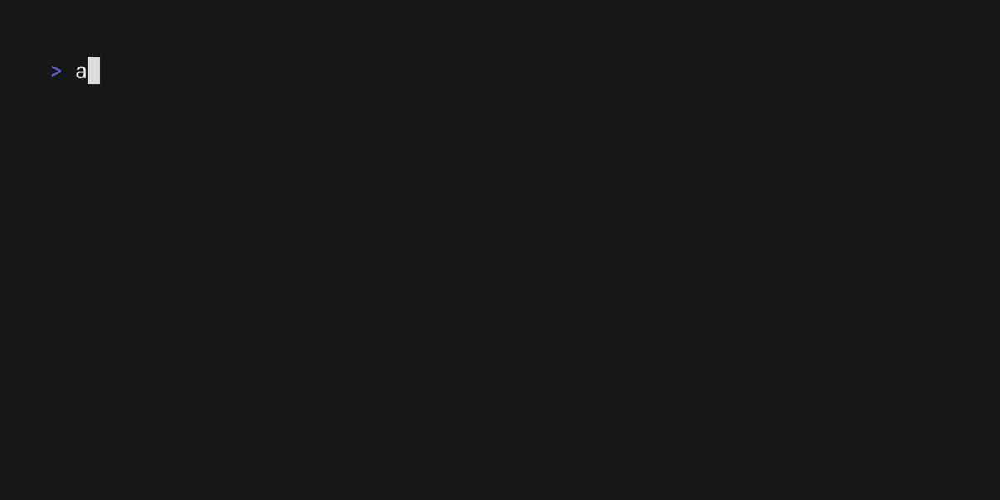

# andcli

Load, view, decrypt and copy 2FA tokens from encrypted backup files directly in your shell. andcli uses the awesome Bubbletea library for a nice TUI.

At the moment andcli can handle encrypted backups from the following providers:

* [andotp](https://github.com/andOTP/andOTP)
* [aegis](https://getaegis.app)



## Installation

Download a [prebuild release](https://github.com/tjblackheart/andcli/releases) and place it somewhere in your path. If you have Go installed you can build it yourself: `go install github.com/tjblackheart/andcli@latest`.

## Usage

1. Export an **encrypted, password protected** backup from your app and save it into your preferred cloud provider.
2. Fire up `andcli` and point it to this file with `-f <path-to-file>`. Specify the vault type via `-t <file-type>`: choose between `andotp` or `aegis`. The path and type will get cached, so you have to do this only once.
3. Enter the encryption password.
4. Navigate via keyboard, press `Enter` to view a token and press `c` top copy it into the clipboard (**Linux/Mac only**).
5. If you are running Linux: Press the middle mouse button to paste the token. On Mac, hit CMD+v.

## TODO

* At the moment it is not possible to copy a token on a Windows machine.
* The test coverage sucks.
* Implement a search.

## Options

```bash
Usage of andcli:
  -f string
        Path to the encrypted vault
  -t string
        Vault type (andotp, aegis)
  -v    Show current version
```

## Credits

* [Bubbletea](https://github.com/charmbracelet/bubbletea)
* [GoTP](https://github.com/xlzd/gotp)
* [go-andotp](https://github.com/grijul/go-andotp)
* [color](https://github.com/fatih/color)
* [vhs](https://github.com/charmbracelet/vhs)

## License

[MIT](LICENSE.md)
